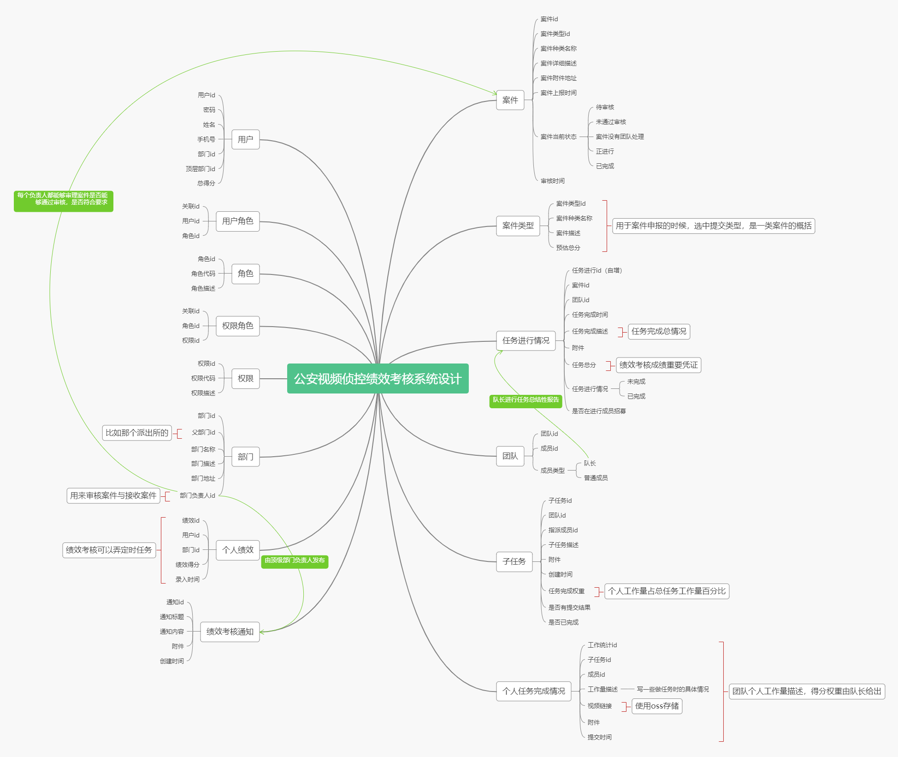

# 大致功能文档

## 数据原型

## 注意要点（功能实现描述）

1. 案件由群众提供
2. 群众提供案件后，由部门负责人进行审核
3. 审核通过后，部门每个人都可以接案件任务
4. 接案件任务的时候可以指派成员，也可以创建后，打开招募窗口，让队员自行加入。
5. 案件接收后，队长能够给每个成员分配子任务，包括任务权重
6. 每个成员在完成任务后，提交相关的工作文档，视频由oss存储，上下行全走外网，减轻服务器负担。
7. 绩效考核通知，由顶级管理员发布，例如整个派出所的管理员，部门管理员没有权限
8. 绩效统计由定时任务完成，比如每个月进行一次所有成员的绩效计算，并存入个人绩效数据中。

## 权限管理说明

> 权限存于Token中，Token具有不可篡改特性，但是能够被查看，所以不能存太敏感的信息
>
> 暂时存放以下信息：
>
> > 用户id，姓名，手机号，部门id，部门名，角色、权限
> >
> > > 角色权限分三类（权限依次增大）：
> > >
> > > 普通用户（普通民警）general
> > >
> > > 基础部门管理员（科室管理员）sectionAdmin
> > >
> > > 顶级部门管理员（派出所管理员）admin
> > >
> > > > 比如角色顶级部门管理员admin有权限：general、sectionAdmin、admin
> > > >
> > > > 基础部门管理员（科室管理员）sectionAdmin有权限：general、sectionAdmin
> > > >
> > > > 普通用户（普通民警）general有权限：general
> > > >
> > > > > 接口权限管理可以按角色管理，也可以按权限来管理
> > > > >
> > > > > 角色命名统一为ROLE_角色名

## 功能接口

### 凭证资源管理

1. Oauth2密码模式
2. jwtToken进行权限管理
3. 获取令牌接口
4. 验证令牌接口
5. 刷新令牌接口

### 用户模块操作

1. 用户登录
2. 用户修改密码（用旧密码修改）
3. 管理员修改姓名、手机号、部门id（放到同一个界面修改）（部门管理员与超级管理员）
5. 管理员添加用户（超级管理员）
5. 修改权限（超级管理员）

### 部门管理

1. 查看部门结构
2. 查看部门人员构成
3. 修改部门结构（需要顶级部门管理员权限）
4. 修改负责人（超级管理员）

> 比如修改：部门名称、部门描述、部门地址、部门负责人 ，都统一放到一个界面修改
>
> 另外部门负责人自己可以修改部门负责人

### 绩效管理

1. 根据用户id查看个人绩效列表（可分页或者按年统计月绩效）（需要详细讨论）:heavy_exclamation_mark:
2. 发布绩效考核通知（顶层管理员才能发布）

### 案件管理

1. 为群众提供上报案件的入口，可以提供案件信息（不需要登录）（可选案件类型，需要案件表与案件类型表联动）
2. 案件状态公示（不需要登录）（按案件上报时间排列，需分页）
3. 案件审核，案件审核通过后才能进行处理（需要部门管理员权限），审核通过后转为没有团队处理状态，反之为未通过审核
4. 通过审核的案件才能够被接收任务，需要用户接案件，接案件后会生成团队（队长指派）与任务进行情况（将团队id嵌入）
5. 团队成员的指派（需要选中任务，且是案件队长才行）（添加成员到团队中）
6. 队长给队员分配子任务，（插入子任务信息）
7. 队员查看未完成的子任务（根据子任务是否有结果查询）
8. 提交完成子任务结果，可以保存临时结果。